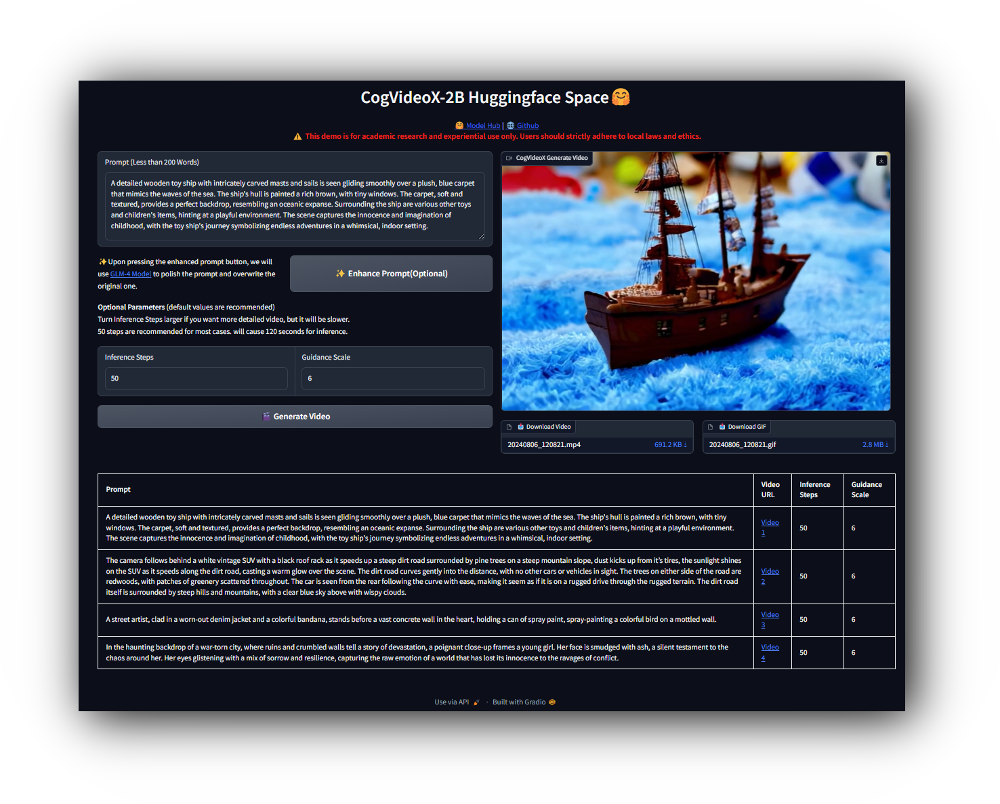

# CogVideo & CogVideoX

[Read this in English](./README_zh.md)

[日本語で読む](./README_ja.md)


<div align="center">

</div>
<p align="center">
在 <a href="https://huggingface.co/spaces/THUDM/CogVideoX-5B" target="_blank"> 🤗 Huggingface Space</a> 或 <a href="https://modelscope.cn/studios/ZhipuAI/CogVideoX-5b-demo" target="_blank"> 🤖 ModelScope Space</a> 在线体验 CogVideoX-5B 模型
</p>
<p align="center">
📚 查看 <a href="https://arxiv.org/abs/2408.06072" target="_blank">论文</a> 和 <a href="https://zhipu-ai.feishu.cn/wiki/DHCjw1TrJiTyeukfc9RceoSRnCh" target="_blank">使用文档</a>
</p>
<p align="center">
    👋 加入我们的 <a href="resources/WECHAT.md" target="_blank">微信</a> 和  <a href="https://discord.gg/Qqjtj69f" target="_blank">Discord</a> 
</p>
<p align="center">
📍 前往<a href="https://chatglm.cn/video?fr=osm_cogvideox"> 清影</a> 和 <a href="https://open.bigmodel.cn/?utm_campaign=open&_channel_track_key=OWTVNma9"> API平台</a> 体验更大规模的商业版视频生成模型。
</p>

## 项目更新

- 🔥🔥 **News**: ```2024/8/29```: 使用`pipe.enable_sequential_cpu_offload()` 和 `pipe.vae.enable_slicing()`
  加入到CogVideoX-5B的推理代码中，可以将显存占用下降至`5GB`，请查看[cli_demo](inference/cli_demo.py)的更新。
- 🔥 **News**: ```2024/8/27```: **CogVideoX-2B** 模型开源协议已经修改为**Apache 2.0 协议**。
- 🔥 **News**: ```2024/8/27```:  我们开源 CogVideoX 系列更大的模型 **CogVideoX-5B**
  。我们大幅度优化了模型的推理性能，推理门槛大幅降低，您可以在 `GTX 1080TI` 等早期显卡运行 **CogVideoX-2B**，在 `RTX 3060`
  等桌面端甜品卡运行 **CogVideoX-5B** 模型。 请严格按照[要求](requirements.txt)
  更新安装依赖，推理代码请查看 [cli_demo](inference/cli_demo.py)。
- 🔥**News**: ```2024/8/20```: [VEnhancer](https://github.com/Vchitect/VEnhancer) 已经支持对 CogVideoX
  生成的视频进行增强，实现更高分辨率，更高质量的视频渲染。欢迎大家按照[教程](tools/venhancer/README_zh.md)体验使用。
- 🔥**News**: ```2024/8/15```: CogVideoX 依赖中`SwissArmyTransformer`依赖升级到`0.4.12`,
  微调不再需要从源代码安装`SwissArmyTransformer`。同时，`Tied VAE` 技术已经被应用到 `diffusers`
  库中的实现，请从源代码安装 `diffusers` 和 `accelerate` 库，推理 CogVdideoX 仅需
  12GB显存。推理代码需要修改，请查看 [cli_demo](inference/cli_demo.py)
- 🔥 **News**: ```2024/8/12```: CogVideoX 论文已上传到arxiv，欢迎查看[论文](https://arxiv.org/abs/2408.06072)。
- 🔥 **News**: ```2024/8/7```: CogVideoX 已经合并入 `diffusers`
  0.30.0版本，单张3090可以推理，详情请见[代码](inference/cli_demo.py)。
- 🔥 **News**: ```2024/8/6```: 我们开源 **3D Causal VAE**，用于 **CogVideoX-2B**，可以几乎无损地重构视频。
- 🔥 **News**: ```2024/8/6```: 我们开源 CogVideoX 系列视频生成模型的第一个模型, **CogVideoX-2B**。
- 🌱 **Source**: ```2022/5/19```: 我们开源了 CogVideo 视频生成模型（现在你可以在 `CogVideo` 分支中看到），这是首个开源的基于
  Transformer 的大型文本生成视频模型，您可以访问 [ICLR'23 论文](https://arxiv.org/abs/2205.15868) 查看技术细节。
  **性能更强，参数量更大的模型正在到来的路上～，欢迎关注**

## 目录

跳转到指定部分：

- [快速开始](#快速开始)
    - [SAT](#sat)
    - [Diffusers](#Diffusers)
- [CogVideoX-2B 视频作品](#cogvideox-2b-视频作品)
- [CogVideoX模型介绍](#模型介绍)
- [完整项目代码结构](#完整项目代码结构)
    - [Inference](#inference)
    - [SAT](#sat)
    - [Tools](#tools)
- [开源项目规划](#开源项目规划)
- [模型协议](#模型协议)
- [CogVideo(ICLR'23)模型介绍](#cogvideoiclr23)
- [引用](#引用)

## 快速开始

### 提示词优化

在开始运行模型之前，请参考 [这里](inference/convert_demo.py) 查看我们是怎么使用GLM-4(或者同级别的其他产品，例如GPT-4)
大模型对模型进行优化的，这很重要，
由于模型是在长提示词下训练的，一个好的提示词直接影响了视频生成的质量。

### SAT

查看sat文件夹下的 [sat_demo](sat/README.md)：包含了 SAT 权重的推理代码和微调代码，推荐基于此代码进行 CogVideoX
模型结构的改进，研究者使用该代码可以更好的进行快速的迭代和开发。

### Diffusers

```
pip install -r requirements.txt
```

查看[diffusers_demo](inference/cli_demo.py)：包含对推理代码更详细的解释，包括各种关键的参数。

## 视频作品

### CogVideoX-5B

<table border="0" style="width: 100%; text-align: left; margin-top: 20px;">
  <tr>
      <td>
          <video src="https://github.com/user-attachments/assets/cf5953ea-96d3-48fd-9907-c4708752c714" width="100%" controls autoplay loop></video>
      </td>
      <td>
          <video src="https://github.com/user-attachments/assets/fe0a78e6-b669-4800-8cf0-b5f9b5145b52" width="100%" controls autoplay loop></video>
      </td>
       <td>
          <video src="https://github.com/user-attachments/assets/c182f606-8f8c-421d-b414-8487070fcfcb" width="100%" controls autoplay loop></video>
     </td>
      <td>
          <video src="https://github.com/user-attachments/assets/7db2bbce-194d-434d-a605-350254b6c298" width="100%" controls autoplay loop></video>
     </td>
  </tr>
  <tr>
      <td>
          <video src="https://github.com/user-attachments/assets/62b01046-8cab-44cc-bd45-4d965bb615ec" width="100%" controls autoplay loop></video>
      </td>
      <td>
          <video src="https://github.com/user-attachments/assets/d78e552a-4b3f-4b81-ac3f-3898079554f6" width="100%" controls autoplay loop></video>
      </td>
       <td>
          <video src="https://github.com/user-attachments/assets/30894f12-c741-44a2-9e6e-ddcacc231e5b" width="100%" controls autoplay loop></video>
     </td>
      <td>
          <video src="https://github.com/user-attachments/assets/926575ca-7150-435b-a0ff-4900a963297b" width="100%" controls autoplay loop></video>
     </td>
  </tr>
</table>

### CogVideoX-2B

<table border="0" style="width: 100%; text-align: left; margin-top: 20px;">
  <tr>
      <td>
          <video src="https://github.com/user-attachments/assets/ea3af39a-3160-4999-90ec-2f7863c5b0e9" width="100%" controls autoplay loop></video>
      </td>
      <td>
          <video src="https://github.com/user-attachments/assets/9de41efd-d4d1-4095-aeda-246dd834e91d" width="100%" controls autoplay loop></video>
      </td>
       <td>
          <video src="https://github.com/user-attachments/assets/941d6661-6a8d-4a1b-b912-59606f0b2841" width="100%" controls autoplay loop></video>
     </td>
      <td>
          <video src="https://github.com/user-attachments/assets/938529c4-91ae-4f60-b96b-3c3947fa63cb" width="100%" controls autoplay loop></video>
     </td>
  </tr>
</table>


查看画廊的对应提示词，请点击[这里](resources/galary_prompt.md)

## 模型介绍

CogVideoX是 [清影](https://chatglm.cn/video?fr=osm_cogvideox) 同源的开源版本视频生成模型。
下表展示我们提供的视频生成模型相关基础信息:

<table  style="border-collapse: collapse; width: 100%;">
  <tr>
    <th style="text-align: center;">模型名</th>
    <th style="text-align: center;">CogVideoX-2B</th>
    <th style="text-align: center;">CogVideoX-5B</th>
  </tr>
  <tr>
    <td style="text-align: center;">模型介绍</td>
    <td style="text-align: center;">入门级模型，兼顾兼容性。运行，二次开发成本低。</td>
    <td style="text-align: center;">视频生成质量更高，视觉效果更好的更大尺寸模型。</td>
  </tr>
  <tr>
    <td style="text-align: center;">推理精度</td>
    <td style="text-align: center;"><b>FP16*(推荐)</b>, BF16, FP32，FP8*，INT8，不支持INT4</td>
    <td style="text-align: center;"><b>BF16(推荐)</b>, FP16, FP32，FP8*，INT8，不支持INT4</td>
  </tr>
  <tr>
    <td style="text-align: center;">单GPU显存消耗<br></td>
    <td style="text-align: center;"><a href="https://github.com/THUDM/SwissArmyTransformer">SAT</a> FP16: 18GB <br><b>diffusers FP16: 4GB起* </b><br><b>diffusers INT8(torchao): 3.6G起*</b></td>
    <td style="text-align: center;"><a href="https://github.com/THUDM/SwissArmyTransformer">SAT</a> BF16: 26GB <br><b>diffusers BF16 : 5GB起* </b><br><b>diffusers INT8(torchao): 4.4G起* </b></td>
  </tr>
  <tr>
    <td style="text-align: center;">多GPU推理显存消耗</td>
    <td style="text-align: center;"><b>FP16: 10GB* using diffusers</b><br></td>
    <td style="text-align: center;"><b>BF16: 15GB* using diffusers</b><br></td>
  </tr>
  <tr>
    <td style="text-align: center;">推理速度<br>(Step = 50)</td>
    <td style="text-align: center;">FP16: ~90* s</td>
    <td style="text-align: center;">BF16: ~180* s</td>
  </tr>
  <tr>
    <td style="text-align: center;">微调精度</td>
    <td style="text-align: center;"><b>FP16</b></td>
    <td style="text-align: center;"><b>BF16</b></td>
  </tr>
  <tr>
    <td style="text-align: center;">微调显存消耗(每卡)</td>
    <td style="text-align: center;">47 GB (bs=1, LORA)<br> 61 GB (bs=2, LORA)<br> 62GB (bs=1, SFT)</td>
    <td style="text-align: center;">63 GB (bs=1, LORA)<br> 80 GB (bs=2, LORA)<br> 75GB (bs=1, SFT)<br></td>
  </tr>
  <tr>
    <td style="text-align: center;">提示词语言</td>
    <td colspan="2" style="text-align: center;">English*</td>
  </tr>
  <tr>
    <td style="text-align: center;">提示词长度上限</td>
    <td colspan="2" style="text-align: center;">226 Tokens</td>
  </tr>
  <tr>
    <td style="text-align: center;">视频长度</td>
    <td colspan="2" style="text-align: center;">6 秒</td>
  </tr>
  <tr>
    <td style="text-align: center;">帧率</td>
    <td colspan="2" style="text-align: center;">8 帧 / 秒 </td>
  </tr>
  <tr>
    <td style="text-align: center;">视频分辨率</td>
    <td colspan="2" style="text-align: center;">720 * 480，不支持其他分辨率(含微调)</td>
  </tr>
    <tr>
    <td style="text-align: center;">位置编码</td>
    <td style="text-align: center;">3d_sincos_pos_embed</td>
    <td style="text-align: center;">3d_rope_pos_embed<br></td>
  </tr>
  <tr>
    <td style="text-align: center;">下载链接 (Diffusers)</td>
    <td style="text-align: center;"><a href="https://huggingface.co/THUDM/CogVideoX-2b">🤗 HuggingFace</a><br><a href="https://modelscope.cn/models/ZhipuAI/CogVideoX-2b">🤖 ModelScope</a><br><a href="https://wisemodel.cn/models/ZhipuAI/CogVideoX-2b">🟣 WiseModel</a></td>
    <td style="text-align: center;"><a href="https://huggingface.co/THUDM/CogVideoX-5b">🤗 HuggingFace</a><br><a href="https://modelscope.cn/models/ZhipuAI/CogVideoX-5b">🤖 ModelScope</a><br><a href="https://wisemodel.cn/models/ZhipuAI/CogVideoX-5b">🟣 WiseModel</a></td>
  </tr>
  <tr>
    <td style="text-align: center;">下载链接 (SAT)</td>
    <td colspan="2" style="text-align: center;"><a href="./sat/README_zh.md">SAT</a></td>
  </tr>
</table>

**数据解释**

+ 使用 diffusers 库进行测试时，启用了全部`diffusers`库自带的优化，该方案未测试在非**NVIDIA A100 / H100** 外的设备上的实际显存 / 内存占用。通常，该方案可以适配于所有 **NVIDIA 安培架构**
以上的设备。若关闭优化，显存占用会成倍增加，峰值显存约为表格的3倍。但速度提升3-4倍左右。你可以选择性的关闭部分优化，这些优化包括:
```
pipe.enable_sequential_cpu_offload()
pipe.vae.enable_slicing()
pipe.vae.enable_tiling()
```

+ 多GPU推理时，需要关闭 `enable_sequential_cpu_offload()` 优化。
+ 使用 INT8 模型会导致推理速度降低，此举是为了满足显存较低的显卡能正常推理并保持较少的视频质量损失，推理速度大幅降低。
+ 2B 模型采用 `FP16` 精度训练， 5B模型采用 `BF16` 精度训练。我们推荐使用模型训练的精度进行推理。
+ [PytorchAO](https://github.com/pytorch/ao) 和 [Optimum-quanto](https://github.com/huggingface/optimum-quanto/)
  可以用于量化文本编码器、Transformer 和 VAE 模块，以降低 CogVideoX 的内存需求。这使得在免费的 T4 Colab 或更小显存的 GPU
  上运行模型成为可能！同样值得注意的是，TorchAO 量化完全兼容 `torch.compile`，这可以显著提高推理速度。在 `NVIDIA H100`
  及以上设备上必须使用 `FP8` 精度，这需要源码安装 `torch`、`torchao`、`diffusers` 和 `accelerate` Python
  包。建议使用 `CUDA 12.4`。
+ 推理速度测试同样采用了上述显存优化方案，不采用显存优化的情况下，推理速度提升约10%。 只有`diffusers`版本模型支持量化。
+ 模型仅支持英语输入，其他语言可以通过大模型润色时翻译为英语。

## 友情链接

我们非常欢迎来自社区的贡献，并积极的贡献开源社区。以下作品已经对CogVideoX进行了适配，欢迎大家使用:

+ [Xorbits Inference](https://github.com/xorbitsai/inference): 性能强大且功能全面的分布式推理框架，轻松一键部署你自己的模型或内置的前沿开源模型。
+ [ComfyUI-CogVideoXWrapper](https://github.com/kijai/ComfyUI-CogVideoXWrapper) 使用ComfyUI框架，将CogVideoX加入到你的工作流中。
+ [VideoSys](https://github.com/NUS-HPC-AI-Lab/VideoSys): VideoSys 提供了易用且高性能的视频生成基础设施，支持完整的管道，并持续集成最新的模型和技术。
+ [AutoDL镜像](https://www.codewithgpu.com/i/THUDM/CogVideo/CogVideoX-5b-demo): 由社区成员提供的一键部署Huggingface
  Space镜像。
+ [Colab Space](https://github.com/camenduru/CogVideoX-5B-jupyter) 使用 Jupyter Notebook 运行 CogVideoX-5B 模型的 Colab
  代码。

## 完整项目代码结构

本开源仓库将带领开发者快速上手 **CogVideoX** 开源模型的基础调用方式、微调示例。

### inference

+ [cli_demo](inference/cli_demo.py): 更详细的推理代码讲解，常见参数的意义，在这里都会提及。
+ [cli_demo_quantization](inference/cli_demo_quantization.py):
  量化模型推理代码，可以在显存较低的设备上运行，也可以基于此代码修改，以支持运行FP8等精度的CogVideoX模型。请注意，FP8
  仅测试通过，且必须将 `torch-nightly`,`torchao`源代码安装，不建议在生产环境中使用。
+ [diffusers_vae_demo](inference/cli_vae_demo.py): 单独执行VAE的推理代码。
+ [space demo](inference/gradio_composite_demo): Huggingface Space同款的 GUI 代码，植入了插帧，超分工具。
+ [convert_demo](inference/convert_demo.py): 如何将用户的输入转换成适合
  CogVideoX的长输入。因为CogVideoX是在长文本上训练的，所以我们需要把输入文本的分布通过LLM转换为和训练一致的长文本。脚本中默认使用GLM-4，也可以替换为GPT、Gemini等任意大语言模型。
+ [gradio_web_demo](inference/gradio_web_demo.py): 一个简单的gradio网页应用，展示如何使用 CogVideoX-2B / 5B 模型生成视频。
  与我们的
  Huggingface Space 类似，你可以使用此脚本运行一个简单的网页应用，用于生成视频。

```shell
cd inference
# For Linux and Windows users
python gradio_web_demo.py

# For macOS with Apple Silicon users, Intel not supported, this maybe 20x slower than RTX 4090
PYTORCH_ENABLE_MPS_FALLBACK=1 python gradio_web_demo.py
```

<div style="text-align: center;">
    
</div>

### sat

+ [sat_demo](sat/README_zh.md): 包含了 SAT 权重的推理代码和微调代码，推荐基于 CogVideoX
  模型结构进行改进，创新的研究者使用改代码以更好的进行快速的堆叠和开发。

### tools

本文件夹包含了一些工具，用于模型的转换 / Caption 等工作。

+ [convert_weight_sat2hf](tools/convert_weight_sat2hf.py): 将 SAT 模型权重转换为 Huggingface 模型权重。
+ [caption_demo](tools/caption/README_zh.md):  Caption 工具，对视频理解并用文字输出的模型。

## CogVideo(ICLR'23)

[CogVideo: Large-scale Pretraining for Text-to-Video Generation via Transformers](https://arxiv.org/abs/2205.15868)
的官方repo位于[CogVideo branch](https://github.com/THUDM/CogVideo/tree/CogVideo)。

**CogVideo可以生成高帧率视频，下面展示了一个32帧的4秒视频。**


<div align="center">
  <video src="https://github.com/user-attachments/assets/ea3af39a-3160-4999-90ec-2f7863c5b0e9" width="80%" controls autoplay></video>
</div>

CogVideo的demo网站在[https://models.aminer.cn/cogvideo](https://models.aminer.cn/cogvideo/)。您可以在这里体验文本到视频生成。
*原始输入为中文。*

## 引用

🌟 如果您发现我们的工作有所帮助，欢迎引用我们的文章，留下宝贵的stars

```
@article{yang2024cogvideox,
  title={CogVideoX: Text-to-Video Diffusion Models with An Expert Transformer},
  author={Yang, Zhuoyi and Teng, Jiayan and Zheng, Wendi and Ding, Ming and Huang, Shiyu and Xu, Jiazheng and Yang, Yuanming and Hong, Wenyi and Zhang, Xiaohan and Feng, Guanyu and others},
  journal={arXiv preprint arXiv:2408.06072},
  year={2024}
}
@article{hong2022cogvideo,
  title={CogVideo: Large-scale Pretraining for Text-to-Video Generation via Transformers},
  author={Hong, Wenyi and Ding, Ming and Zheng, Wendi and Liu, Xinghan and Tang, Jie},
  journal={arXiv preprint arXiv:2205.15868},
  year={2022}
}
```

## 开源项目规划

- [x] CogVideoX 模型开源
    - [x] CogVideoX 模型推理示例 (CLI / Web Demo)
    - [x] CogVideoX 在线体验示例 (Huggingface Space)
    - [x] CogVideoX 开源模型API接口示例 (Huggingface)
    - [x] CogVideoX 模型微调示例 (SAT)
    - [ ] CogVideoX 模型微调示例 (Huggingface Diffusers)
    - [X] CogVideoX-5B 开源 (适配 CogVideoX-2B 套件)
    - [X] CogVideoX 技术报告公开
    - [X] CogVideoX 技术讲解视频
- [ ] CogVideoX 周边工具
    - [X] 视频超分 / 插帧基础套件
    - [ ] 推理框架适配
    - [ ] ComfyUI 完整生态工具

我们欢迎您的贡献，您可以点击[这里](resources/contribute_zh.md)查看更多信息。

## 模型协议

本仓库代码使用 [Apache 2.0 协议](LICENSE) 发布。

CogVideoX-2B 模型 (包括其对应的Transformers模块，VAE模块) 根据 [Apache 2.0 协议](LICENSE) 许可证发布。

CogVideoX-5B 模型 (Transformers 模块)
根据 [CogVideoX LICENSE](https://huggingface.co/THUDM/CogVideoX-5b/blob/main/LICENSE)
许可证发布。
