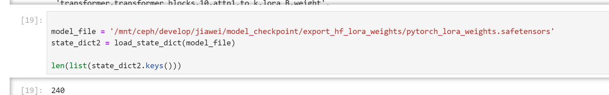

# SAT CogVideoX-2B

[中文阅读](./README_zh.md)

[日本語で読む](./README_ja.md)

This folder contains the inference code using [SAT](https://github.com/THUDM/SwissArmyTransformer) weights and the
fine-tuning code for SAT weights.

This code is the framework used by the team to train the model. It has few comments and requires careful study.

## Inference Model

### 1. Ensure that you have correctly installed the dependencies required by this folder.

```shell
pip install -r requirements.txt
```

### 2. Download the model weights

### 2. Download model weights

First, go to the SAT mirror to download the model weights. For the CogVideoX-2B model, please download as follows:

```shell
mkdir CogVideoX-2b-sat
cd CogVideoX-2b-sat
wget https://cloud.tsinghua.edu.cn/f/fdba7608a49c463ba754/?dl=1
mv 'index.html?dl=1' vae.zip
unzip vae.zip
wget https://cloud.tsinghua.edu.cn/f/556a3e1329e74f1bac45/?dl=1
mv 'index.html?dl=1' transformer.zip
unzip transformer.zip
```

For the CogVideoX-5B model, please download the `transformers` file as follows link:
(VAE files are the same as 2B)

+ [CogVideoX-5B](https://cloud.tsinghua.edu.cn/d/fcef5b3904294a6885e5/?p=%2F&mode=list)
+ [CogVideoX-5B-I2V](https://cloud.tsinghua.edu.cn/d/5cc62a2d6e7d45c0a2f6/?p=%2F1&mode=list)

Next, you need to format the model files as follows:

```
.
├── transformer
│   ├── 1000 (or 1)
│   │   └── mp_rank_00_model_states.pt
│   └── latest
└── vae
    └── 3d-vae.pt
```

Due to large size of model weight file, using `git lfs` is recommended. Installation of `git lfs` can be
found [here](https://github.com/git-lfs/git-lfs?tab=readme-ov-file#installing)

Next, clone the T5 model, which is not used for training and fine-tuning, but must be used.
> T5 model is available on [Modelscope](https://modelscope.cn/models/ZhipuAI/CogVideoX-2b) as well.

```shell
git clone https://huggingface.co/THUDM/CogVideoX-2b.git
mkdir t5-v1_1-xxl
mv CogVideoX-2b/text_encoder/* CogVideoX-2b/tokenizer/* t5-v1_1-xxl
```

By following the above approach, you will obtain a safetensor format T5 file. Ensure that there are no errors when
loading it into Deepspeed in Finetune.

```
├── added_tokens.json
├── config.json
├── model-00001-of-00002.safetensors
├── model-00002-of-00002.safetensors
├── model.safetensors.index.json
├── special_tokens_map.json
├── spiece.model
└── tokenizer_config.json

0 directories, 8 files
```

### 3. Modify the file in `configs/cogvideox_2b.yaml`.

```yaml
model:
  scale_factor: 1.15258426
  disable_first_stage_autocast: true
  log_keys:
    - txt

  denoiser_config:
    target: sgm.modules.diffusionmodules.denoiser.DiscreteDenoiser
    params:
      num_idx: 1000
      quantize_c_noise: False

      weighting_config:
        target: sgm.modules.diffusionmodules.denoiser_weighting.EpsWeighting
      scaling_config:
        target: sgm.modules.diffusionmodules.denoiser_scaling.VideoScaling
      discretization_config:
        target: sgm.modules.diffusionmodules.discretizer.ZeroSNRDDPMDiscretization
        params:
          shift_scale: 3.0

  network_config:
    target: dit_video_concat.DiffusionTransformer
    params:
      time_embed_dim: 512
      elementwise_affine: True
      num_frames: 49
      time_compressed_rate: 4
      latent_width: 90
      latent_height: 60
      num_layers: 30
      patch_size: 2
      in_channels: 16
      out_channels: 16
      hidden_size: 1920
      adm_in_channels: 256
      num_attention_heads: 30

      transformer_args:
        checkpoint_activations: True ## using gradient checkpointing
        vocab_size: 1
        max_sequence_length: 64
        layernorm_order: pre
        skip_init: false
        model_parallel_size: 1
        is_decoder: false

      modules:
        pos_embed_config:
          target: dit_video_concat.Basic3DPositionEmbeddingMixin
          params:
            text_length: 226
            height_interpolation: 1.875
            width_interpolation: 1.875

        patch_embed_config:
          target: dit_video_concat.ImagePatchEmbeddingMixin
          params:
            text_hidden_size: 4096

        adaln_layer_config:
          target: dit_video_concat.AdaLNMixin
          params:
            qk_ln: True

        final_layer_config:
          target: dit_video_concat.FinalLayerMixin

  conditioner_config:
    target: sgm.modules.GeneralConditioner
    params:
      emb_models:
        - is_trainable: false
          input_key: txt
          ucg_rate: 0.1
          target: sgm.modules.encoders.modules.FrozenT5Embedder
          params:
            model_dir: "t5-v1_1-xxl" # Absolute path to the CogVideoX-2b/t5-v1_1-xxl weights folder
            max_length: 226

  first_stage_config:
    target: vae_modules.autoencoder.VideoAutoencoderInferenceWrapper
    params:
      cp_size: 1
      ckpt_path: "CogVideoX-2b-sat/vae/3d-vae.pt" # Absolute path to the CogVideoX-2b-sat/vae/3d-vae.pt folder
      ignore_keys: [ 'loss' ]

      loss_config:
        target: torch.nn.Identity

      regularizer_config:
        target: vae_modules.regularizers.DiagonalGaussianRegularizer

      encoder_config:
        target: vae_modules.cp_enc_dec.ContextParallelEncoder3D
        params:
          double_z: true
          z_channels: 16
          resolution: 256
          in_channels: 3
          out_ch: 3
          ch: 128
          ch_mult: [ 1, 2, 2, 4 ]
          attn_resolutions: [ ]
          num_res_blocks: 3
          dropout: 0.0
          gather_norm: True

      decoder_config:
        target: vae_modules.cp_enc_dec.ContextParallelDecoder3D
        params:
          double_z: True
          z_channels: 16
          resolution: 256
          in_channels: 3
          out_ch: 3
          ch: 128
          ch_mult: [ 1, 2, 2, 4 ]
          attn_resolutions: [ ]
          num_res_blocks: 3
          dropout: 0.0
          gather_norm: False

  loss_fn_config:
    target: sgm.modules.diffusionmodules.loss.VideoDiffusionLoss
    params:
      offset_noise_level: 0
      sigma_sampler_config:
        target: sgm.modules.diffusionmodules.sigma_sampling.DiscreteSampling
        params:
          uniform_sampling: True
          num_idx: 1000
          discretization_config:
            target: sgm.modules.diffusionmodules.discretizer.ZeroSNRDDPMDiscretization
            params:
              shift_scale: 3.0

  sampler_config:
    target: sgm.modules.diffusionmodules.sampling.VPSDEDPMPP2MSampler
    params:
      num_steps: 50
      verbose: True

      discretization_config:
        target: sgm.modules.diffusionmodules.discretizer.ZeroSNRDDPMDiscretization
        params:
          shift_scale: 3.0

      guider_config:
        target: sgm.modules.diffusionmodules.guiders.DynamicCFG
        params:
          scale: 6
          exp: 5
          num_steps: 50
```

### 4. Modify the file in `configs/inference.yaml`.

```yaml
args:
  latent_channels: 16
  mode: inference
  load: "{absolute_path/to/your}/transformer" # Absolute path to the CogVideoX-2b-sat/transformer folder
  # load: "{your lora folder} such as zRzRzRzRzRzRzR/lora-disney-08-20-13-28" # This is for Full model without lora adapter

  batch_size: 1
  input_type: txt # You can choose txt for pure text input, or change to cli for command line input
  input_file: configs/test.txt # Pure text file, which can be edited
  sampling_num_frames: 13  # Must be 13, 11 or 9
  sampling_fps: 8
  fp16: True # For CogVideoX-2B
  #  bf16: True # For CogVideoX-5B
  output_dir: outputs/
  force_inference: True
```

+ Modify `configs/test.txt` if multiple prompts is required, in which each line makes a prompt.
+ For better prompt formatting, refer to [convert_demo.py](../inference/convert_demo.py), for which you should set the
  OPENAI_API_KEY as your environmental variable.
+ Modify `input_type` in `configs/inference.yaml` if use command line as prompt iuput.

```yaml
input_type: cli
```

This allows input from the command line as prompts.

Change `output_dir` if you wish to modify the address of the output video

```yaml
output_dir: outputs/
```

It is saved by default in the `.outputs/` folder.

### 5. Run the inference code to perform inference.

```shell
bash inference.sh
```

## Fine-tuning the Model

### Preparing the Dataset

The dataset format should be as follows:

```
.
├── labels
│   ├── 1.txt
│   ├── 2.txt
│   ├── ...
└── videos
    ├── 1.mp4
    ├── 2.mp4
    ├── ...
```

Each text file shares the same name as its corresponding video, serving as the label for that video. Videos and labels
should be matched one-to-one. Generally, a single video should not be associated with multiple labels.

For style fine-tuning, please prepare at least 50 videos and labels with similar styles to ensure proper fitting.

### Modifying Configuration Files

We support two fine-tuning methods: `Lora` and full-parameter fine-tuning. Please note that both methods only fine-tune
the `transformer` part and do not modify the `VAE` section. `T5` is used solely as an Encoder. Please modify
the `configs/sft.yaml` (for full-parameter fine-tuning) file as follows:

```
  # checkpoint_activations: True ## Using gradient checkpointing (Both checkpoint_activations in the config file need to be set to True)
  model_parallel_size: 1 # Model parallel size
  experiment_name: lora-disney  # Experiment name (do not modify)
  mode: finetune # Mode (do not modify)
  load: "{your_CogVideoX-2b-sat_path}/transformer" ## Transformer model path
  no_load_rng: True # Whether to load random seed
  train_iters: 1000 # Training iterations
  eval_iters: 1 # Evaluation iterations
  eval_interval: 100    # Evaluation interval
  eval_batch_size: 1  # Evaluation batch size
  save: ckpts # Model save path
  save_interval: 100 # Model save interval
  log_interval: 20 # Log output interval
  train_data: [ "your train data path" ]
  valid_data: [ "your val data path" ] # Training and validation datasets can be the same
  split: 1,0,0 # Training, validation, and test set ratio
  num_workers: 8 # Number of worker threads for data loader
  force_train: True # Allow missing keys when loading checkpoint (T5 and VAE are loaded separately)
  only_log_video_latents: True # Avoid memory overhead caused by VAE decode
  deepspeed:
    bf16:
      enabled: False # For CogVideoX-2B set to False and for CogVideoX-5B set to True
    fp16:
      enabled: True  # For CogVideoX-2B set to True and for CogVideoX-5B set to False
```

If you wish to use Lora fine-tuning, you also need to modify the `cogvideox_<model_parameters>_lora` file:

Here, take `CogVideoX-2B` as a reference:

```
model:
  scale_factor: 1.15258426
  disable_first_stage_autocast: true
  not_trainable_prefixes: [ 'all' ] ## Uncomment
  log_keys:
    - txt'

  lora_config: ## Uncomment
    target: sat.model.finetune.lora2.LoraMixin
    params:
      r: 256
```

### Modifying Run Scripts

Edit `finetune_single_gpu.sh` or `finetune_multi_gpus.sh` to select the configuration file. Below are two examples:

1. If you want to use the `CogVideoX-2B` model and the `Lora` method, you need to modify `finetune_single_gpu.sh`
   or `finetune_multi_gpus.sh`:

```
run_cmd="torchrun --standalone --nproc_per_node=8 train_video.py --base configs/cogvideox_2b_lora.yaml configs/sft.yaml --seed $RANDOM"
```

2. If you want to use the `CogVideoX-2B` model and the `full-parameter fine-tuning` method, you need to
   modify `finetune_single_gpu.sh` or `finetune_multi_gpus.sh`:

```
run_cmd="torchrun --standalone --nproc_per_node=8 train_video.py --base configs/cogvideox_2b.yaml configs/sft.yaml --seed $RANDOM"
```

### Fine-Tuning and Evaluation

Run the inference code to start fine-tuning.

```
bash finetune_single_gpu.sh # Single GPU
bash finetune_multi_gpus.sh # Multi GPUs
```

### Using the Fine-Tuned Model

The fine-tuned model cannot be merged; here is how to modify the inference configuration file `inference.sh`:

```
run_cmd="$environs python sample_video.py --base configs/cogvideox_<model_parameters>_lora.yaml configs/inference.yaml --seed 42"
```

Then, execute the code:

```
bash inference.sh 
```

### Converting to Huggingface Diffusers Supported Weights

The SAT weight format is different from Huggingface's weight format and needs to be converted. Please run:

```shell
python ../tools/convert_weight_sat2hf.py
```

### Exporting Huggingface Diffusers lora LoRA Weights from SAT Checkpoints

After completing the training using the above steps, we get a SAT checkpoint with LoRA weights. You can find the file
at `{args.save}/1000/1000/mp_rank_00_model_states.pt`.

The script for exporting LoRA weights can be found in the CogVideoX repository at `tools/export_sat_lora_weight.py`.
After exporting, you can use `load_cogvideox_lora.py` for inference.

Export command:

```bash
python tools/export_sat_lora_weight.py --sat_pt_path {args.save}/{experiment_name}-09-09-21-10/1000/mp_rank_00_model_states.pt --lora_save_directory {args.save}/export_hf_lora_weights_1/
```

This training mainly modified the following model structures. The table below lists the corresponding structure mappings
for converting to the HF (Hugging Face) format LoRA structure. As you can see, LoRA adds a low-rank weight to the
model's attention structure.

```
'attention.query_key_value.matrix_A.0': 'attn1.to_q.lora_A.weight',
'attention.query_key_value.matrix_A.1': 'attn1.to_k.lora_A.weight',
'attention.query_key_value.matrix_A.2': 'attn1.to_v.lora_A.weight',
'attention.query_key_value.matrix_B.0': 'attn1.to_q.lora_B.weight',
'attention.query_key_value.matrix_B.1': 'attn1.to_k.lora_B.weight',
'attention.query_key_value.matrix_B.2': 'attn1.to_v.lora_B.weight',
'attention.dense.matrix_A.0': 'attn1.to_out.0.lora_A.weight',
'attention.dense.matrix_B.0': 'attn1.to_out.0.lora_B.weight'
```

Using export_sat_lora_weight.py, you can convert the SAT checkpoint into the HF LoRA format.

