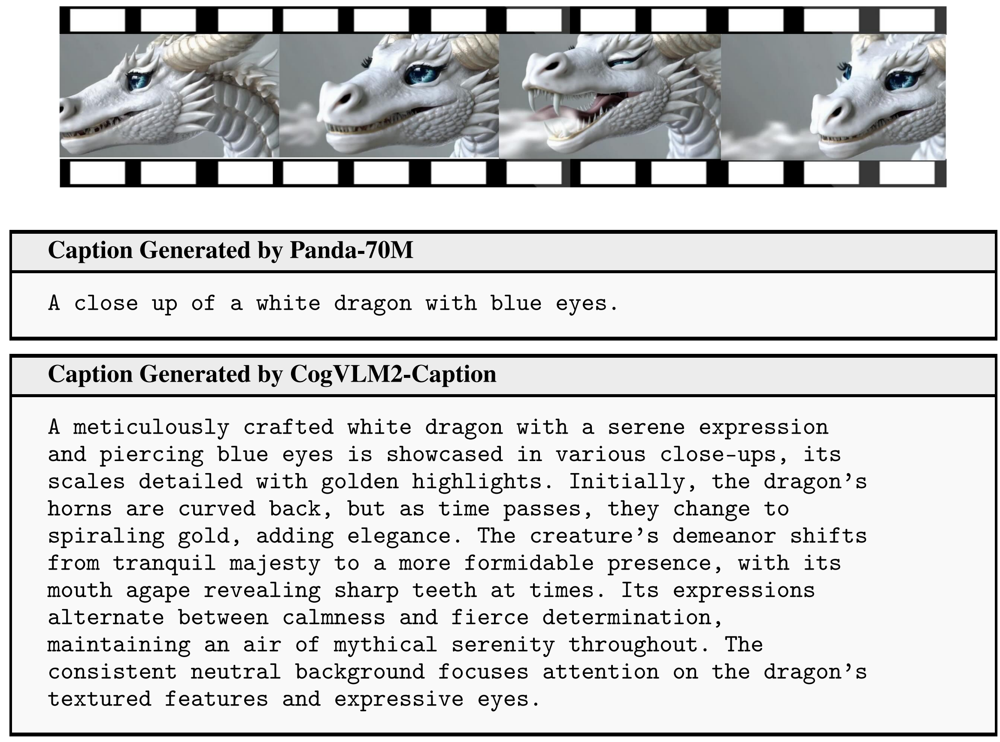
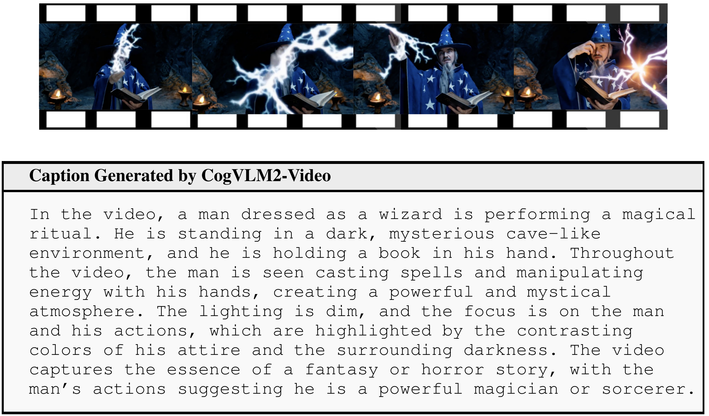

# 视频Caption

通常，大多数视频数据不带有相应的描述性文本，因此需要将视频数据转换为文本描述，以提供必要的训练数据用于文本到视频模型。

## 项目更新
- 🔥🔥 **News**: ```2024/9/19```: CogVideoX 训练过程中用于将视频数据转换为文本描述的 Caption
  模型 [CogVLM2-Caption](https://huggingface.co/THUDM/cogvlm2-llama3-caption)
  已经开源。欢迎前往下载并使用。

## 通过 CogVLM2-Caption 模型生成视频Caption

🤗 [Hugging Face](https://huggingface.co/THUDM/cogvlm2-llama3-caption) | 🤖 [ModelScope](https://modelscope.cn/models/ZhipuAI/cogvlm2-llama3-caption/)

CogVLM2-Caption是用于生成CogVideoX模型训练数据的视频caption模型。

### 安装依赖
```shell
pip install -r requirements.txt
```

### 运行caption模型

```shell
python video_caption.py
```

示例：
<div align="center">
    
</div>

## 通过 CogVLM2-Video 模型生成视频Caption

[Code](https://github.com/THUDM/CogVLM2/tree/main/video_demo) | 🤗 [Hugging Face](https://huggingface.co/THUDM/cogvlm2-video-llama3-chat) | 🤖 [ModelScope](https://modelscope.cn/models/ZhipuAI/cogvlm2-video-llama3-chat) | 📑 [Blog](https://cogvlm2-video.github.io/) ｜ [💬 Online Demo](http://cogvlm2-online.cogviewai.cn:7868/)

CogVLM2-Video 是一个多功能的视频理解模型，具备基于时间戳的问题回答能力。用户可以输入诸如 `Describe this video in detail.` 的提示语给模型，以获得详细的视频Caption：


<div align="center">
    <a href="https://cogvlm2-video.github.io/"></a>
</div>

用户可以使用提供的[代码](https://github.com/THUDM/CogVLM2/tree/main/video_demo)加载模型或配置 RESTful API 来生成视频Caption。


## Citation

🌟 If you find our work helpful, please leave us a star and cite our paper.

CogVLM2-Caption:
```
@article{yang2024cogvideox,
  title={CogVideoX: Text-to-Video Diffusion Models with An Expert Transformer},
  author={Yang, Zhuoyi and Teng, Jiayan and Zheng, Wendi and Ding, Ming and Huang, Shiyu and Xu, Jiazheng and Yang, Yuanming and Hong, Wenyi and Zhang, Xiaohan and Feng, Guanyu and others},
  journal={arXiv preprint arXiv:2408.06072},
  year={2024}
}
```
CogVLM2-Video:
```
@article{hong2024cogvlm2,
  title={CogVLM2: Visual Language Models for Image and Video Understanding},
  author={Hong, Wenyi and Wang, Weihan and Ding, Ming and Yu, Wenmeng and Lv, Qingsong and Wang, Yan and Cheng, Yean and Huang, Shiyu and Ji, Junhui and Xue, Zhao and others},
  journal={arXiv preprint arXiv:2408.16500},
  year={2024}
}
```
